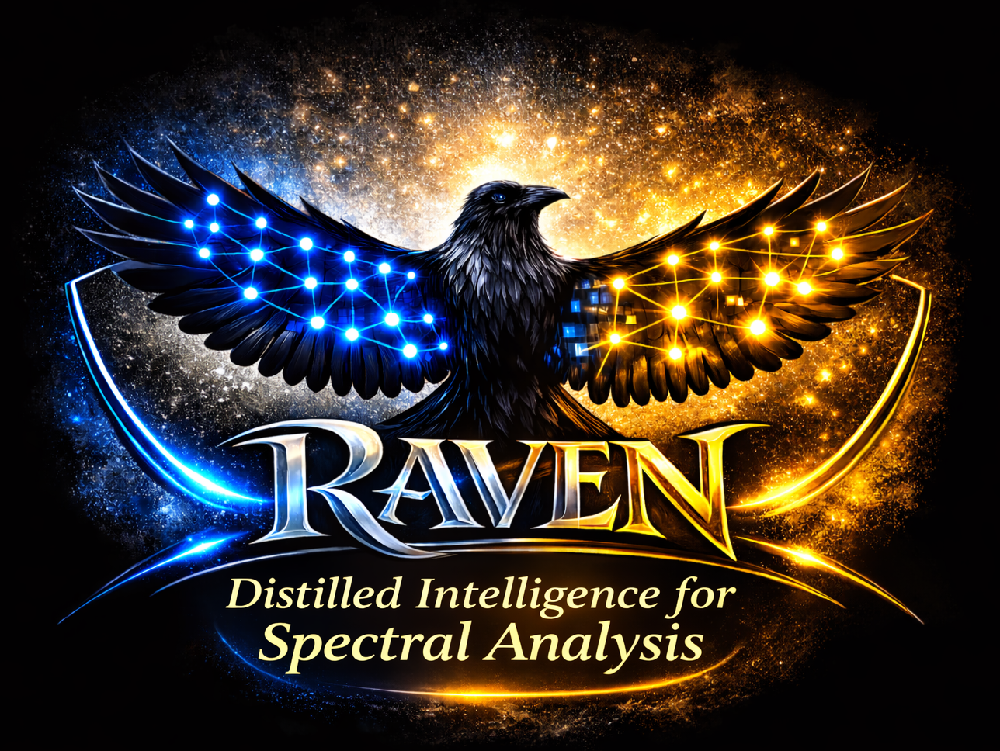

# RAVEN

<p align="center"></p>

**RAVEN: Kernel distillation for fast kernel-free spectroscopic bacterial identification**

RAVEN is a MATLAB teacher–student framework for spectroscopic classification. A fold-contained PCA representation is used to train a data-adapted Nyström RBF teacher with a linear multiclass SVM/ECOC head. The teacher's class-score behavior is distilled into an explicit random-feature student with a ridge readout. Final deployed student inference is kernel-free.

## Repository layout

- **Software:** [`RAVEN_v1.0.0/`](RAVEN_v1.0.0/)
- **Documentation:** [`documentation/`](documentation/)
- **Synthetic example and representative outputs:** [`example/`](example/)
- **Curated publication results:** [`results/`](results/)

## Software

Requirements:

- MATLAB R2026a
- Statistics and Machine Learning Toolbox
- Parallel Computing Toolbox optional
- Windows 10/11 tested
- GPU not required

After downloading the repository, open MATLAB in `RAVEN_v1.0.0/` and run:

```matlab
RAVEN_V1_01
```

## Documentation

**[Download the full illustrated RAVEN User Manual](documentation/RAVEN_User_Manual_v1.0.0.docx)**

Technical documentation is available under `documentation/`.

## Synthetic example

The included software-test dataset is located at:

`example/synthetic/BugCheck_5Classes_10Spectra/`

It contains five artificial classes with 10 spectra per class. These are synthetic software-test data, not experimental or biological measurements.

Compact representative outputs are provided under:

`example/synthetic/BugCheck_5Classes_10Spectra/reference_outputs/`

## Publication results

Lightweight publication-facing results for Datasets A, B, and C are organized separately under `results/`.

Large binary model/state files, preprocessed datasets, and original third-party biological spectra are not intended for the GitHub results directory.

## Repository structure

```text
RAVEN-kernel-distillation/
├── RAVEN_v1.0.0/          # runnable MATLAB software
├── documentation/         # user manual and technical documentation
├── example/               # synthetic input and representative outputs
├── results/               # curated lightweight publication results
├── README.md
├── LICENSE
├── CITATION.cff
├── AUTHORS.md
└── CHANGELOG.md
```

The journal manuscript, Supporting Information, and original third-party biological spectra are intentionally not included in this software repository.

## Citation

Machine-readable citation metadata are provided in `CITATION.cff`. A Zenodo DOI will be added after the immutable `v1.0.0` GitHub release is archived.

## License

RAVEN source code is released under the MIT License. Third-party datasets remain subject to the terms of their original providers.

## Contact

Ario Jafari  
Linköping University  
ario.jafari@liu.se
